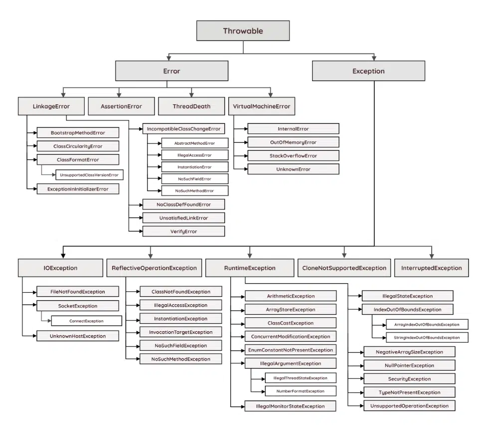

# Eventos

Los eventos son la base para escribir aplicaciones interactivas en MiniLibX. Todos los hooks en MiniLibX no son más que una función que se llama cada vez que se dispara un evento. Dominar todos estos eventos no será necesario, sin embargo, repasaremos rápidamente cada uno de los eventos de X11.

Tanto X-Window como MacOSX son sistemas gráficos bidireccionales. Por un lado, el programa envía órdenes a la pantalla para mostrar píxeles, imágenes, etc. Por otro lado, puede obtener información del teclado y del ratón asociada a la pantalla. Para ello, el programa recibe "eventos" del teclado o del ratón.

<figure><figcaption></figcaption></figure>

### **Interfaz X11**

X11 es la biblioteca que se utiliza junto a MiniLibX. Por lo tanto, no es un secreto que esta cabecera es muy útil para encontrar todos los eventos correspondientes de MiniLibX. Para poder utilizar estos eventos y mascaras es necesaria la siguiente libreria:&#x20;

```c
#include <X11/X.h>
```


En MacOS - Cocoa (AppKit) y OpenGL - versión, minilibx tiene soporte parcial de eventos X11 y no soporta la máscara X11 (el argumento x\_mask de mlx\_hook es inútil, manténgalo en 0).


#### Eventos del X1

Hay una serie de eventos que se pueden describir.

| Key  | Event          |   | Key  | Event            |   | Key  | Event            |
| ---- | -------------- | - | ---- | ---------------- | - | ---- | ---------------- |
| `02` | KeyPress       |   | `14` | NoExpose         |   | `26` | CirculateNotify  |
| `03` | KeyRelease     |   | `15` | VisibilityNotify |   | `27` | CirculateRequest |
| `04` | ButtonPress    |   | `16` | CreateNotify     |   | `28` | PropertyNotify   |
| `05` | ButtonRelease  |   | `17` | DestroyNotify    |   | `29` | SelectionClear   |
| `06` | MotionNotify   |   | `18` | UnmapNotify      |   | `30` | SelectionRequest |
| `07` | EnterNotify    |   | `19` | MapNotify        |   | `31` | SelectionNotify  |
| `08` | LeaveNotify    |   | `20` | MapRequest       |   | `32` | ColormapNotify   |
| `09` | FocusIn        |   | `21` | ReparentNotify   |   | `33` | ClientMessage    |
| `10` | FocusOut       |   | `22` | ConfigureNotify  |   | `34` | MappingNotify    |
| `11` | KeymapNotify   |   | `23` | ConfigureRequest |   | `35` | GenericEvent     |
| `12` | Expose         |   | `24` | GravityNotify    |   | `36` | LASTEvent        |
| `13` | GraphicsExpose |   | `25` | ResizeRequest    |   |      |                  |

#### Mascaras X11

Cada evento X11, también tiene una máscara correspondiente. De este modo, puedes registrar sólo una tecla cuando se dispara, o todas las teclas si dejas tu máscara por defecto. Las máscaras de teclas, por lo tanto, le permiten poner en una lista blanca o negra los eventos de sus suscripciones a eventos. Se permiten las siguientes máscaras:


| Mask       | Description           |      | Mask       | Description              |
| ---------- | --------------------- | ---- | ---------- | ------------------------ |
| `0L`       | NoEventMask           |      | `(1L<<12)` | Button5MotionMask        |
| `(1L<<0)`  | KeyPressMask          |      | `(1L<<13)` | ButtonMotionMask         |
| `(1L<<1)`  | KeyReleaseMask        |      | `(1L<<14)` | KeymapStateMask          |
| `(1L<<2)`  | ButtonPressMask       |      | `(1L<<15)` | ExposureMask             |
| `(1L<<3)`  | ButtonReleaseMask     |      | `(1L<<16)` | VisibilityChangeMask     |
| `(1L<<4)`  | EnterWindowMask       |      | `(1L<<17)` | StructureNotifyMask      |
| `(1L<<5)`  | LeaveWindowMask       |      | `(1L<<18)` | ResizeRedirectMask       |
| `(1L<<6)`  | PointerMotionMask     |      | `(1L<<19)` | SubstructureNotifyMask   |
| `(1L<<7)`  | PointerMotionHintMask |      | `(1L<<20)` | SubstructureRedirectMask |
| `(1L<<8)`  | Button1MotionMask     |      | `(1L<<21)` | FocusChangeMask          |
| `(1L<<9)`  | Button2MotionMask     |      | `(1L<<22)` | PropertyChangeMask       |
| `(1L<<10)` | Button3MotionMask     |      | `(1L<<23)` | ColormapChangeMask       |
| `(1L<<11)` | Button4MotionMask     |      | `(1L<<24)` | OwnerGrabButtonMask      |

### AppleScript key codes

Todo accion realizada a traves del teclado o el mouse tiene  un numero de referencia, de esta manera mediante los eventos que nos facilita MiniLibX podremos saber en todo momento que informacion no esta enviando el usuario de nuestro programa. Para asi si lo deseasmos estabelcerle a ciertas acciones una funcion o accion corespondiente.

La key codes del teclado de mac son las [siguientes](https://eastmanreference.com/complete-list-of-applescript-key-codes):

<figure><figcaption></figcaption></figure>

### Tipos de eventos

Para que podamos registrar eventos, el minilibx nos proporciona un conjunto de funciones llamadas hooks que podremos utilizar para registrar eventos antes de que se llame a `mlx_loop`. Esta funcion deja el programa en un bucle infinito, para asi poder recibir los datos de entrada a traves del teclado y asi ejecutar las funciones correspodientes.

```c
int    mlx_loop ( void *mlx_ptr );
```

#### mlx\_hook <a href="#mlx_hook" id="mlx_hook"></a>

El estar a la escucha de eventos es una de las herramientas más potentes que proporciona MiniLibX. Permite registrarse a cualquiera de los eventos mencionados con la llamada de una simple función de registro de eventos.

Para ello, llamamos a la función mlx\_hook.

```c
void mlx_hook(mlx_win_list_t *win_ptr, int x_event, int x_mask, int (*f)(), void *param)
```

> Alguna versión de mlbx no implementa x\_mask y sea cual sea el valor no habrá máscara.

#### Prototipo de las funciones de evento

Las funciones de evento tienen un prototipo diferente dependiendo del evento de enganche.


| Hooking event   | code | Prototype                                         |
| --------------- | ---- | ------------------------------------------------- |
| ON\_KEYDOWN     | 2    | `int (*f)(int keycode, void *param)`              |
| ON\_KEYUP\*     | 3    | `int (*f)(int keycode, void *param)`              |
| ON\_MOUSEDOWN\* | 4    | `int (*f)(int button, int x, int y, void *param)` |
| ON\_MOUSEUP     | 5    | `int (*f)(int button, int x, int y, void *param)` |
| ON\_MOUSEMOVE   | 6    | `int (*f)(int x, int y, void *param)`             |
| ON\_EXPOSE\*    | 12   | `int (*f)(void *param)`                           |
| ON\_DESTROY     | 17   | `int (*f)(void *param)`                           |

El prototipo hacer referencia al prototipo de la funcion que le pasamos como parametro ( int \*f() ) a mlx\_hook o a cualquiera de sus alias.

#### Alias para registro de eventos

Para facilitar el trabajo Minilibx tiene algunas funciones que realizan el mismo trabajo que `mlx_hook` con ciertos parametros:

* `mlx_expose_hook` Una parte de la ventana debe ser redibujada (esto se llama un evento de "exposición", y es su programa manejarlo). Evento (`12`).
* `mlx_key_hook` Una tecla es presionada. Evento (`3`).
* `mlx_mouse_hook` Se pulsa el botón del ratón. Evento (`4`)

```c
int	mlx_mouse_hook (void *win_ptr, int (*funct_ptr)(), void *param);
int	mlx_key_hook (void *win_ptr, int (*funct_ptr)(), void *param);
int	mlx_expose_hook (void *win_ptr, int (*funct_ptr)(), void *param);
```

#### mlx\_key\_hook

`mlx_key_hook` registra cada tecla que pulsemos y enviara como parametros a la funcion que le hayamos especifciado `*funct_ptr)()` el numero correspondiente de cada tecla. Para poder acceder a este valor lo haremos mediante el argumento `keycode` de la fucnion `*fuct_ptr()`.

> mlx\__key\_hook se acciona al **soltar** la tecla pulsada, mientras este pulsada no se activara el evento._

Este es uno entre los dos argumentos que tendremos que declarar a la funcion que utilicemos para pasar como parametro a `mlx_key_hook`. El otro es `void *param` que sirve para pasar como parametro la estrcutura que hayameos creado para guardar las vairables de mlx. Este parametro luego habra que castearlo.

```c
int    funct_ptr(int keycode, void *param);
```

#### mlx\_mouse\_hook

Con respecto a los eventos de raton cada accion qque podenmos ralizar con el raton tambien tiene un numero asginado:

Keycode del ratón para MacOS:

* Left click: 1
* Right click: 2
* Middle click: 3
* Scroll up: 4
* Scroll down : 5

<figure><figcaption></figcaption></figure>

### Ejemplo

```c
#include <mlx.h>
#include <stdio.h>

typedef struct	s_vars {
	void	*mlx;
	void	*win;
}				t_vars;

int	key_hook(int keycode, t_vars *vars)
{
	printf("The key pressed is: %d\n", keycode);
	return (0);
}

int	main(void)
{
	t_vars	vars;

	vars.mlx = mlx_init();
	vars.win = mlx_new_window(vars.mlx, 640, 480, "Hello world!");
	mlx_key_hook(vars.win, key_hook, &vars);
	mlx_loop(vars.mlx);
}
```

Esta funcion escribira en pantalla el keycode de cada teclas pulsada por el usuario en el a traves del teclado.
