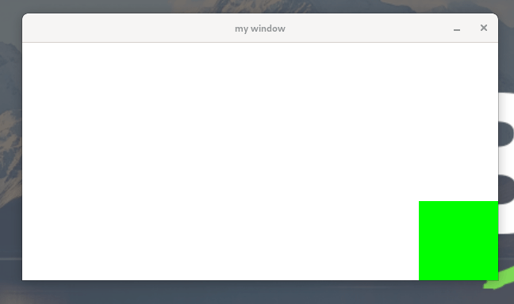

# Imprimir Pixels

### Métricas de la pantalla

Antes de empezar, me gustaría asegurarme de que todos estamos en la misma página.

Una pantalla de ordenador es básicamente un objeto 2D que tiene coordenadas `x` e `y`. Por convención, se considera que la esquina superior izquierda de la pantalla es el origen (x = 0, y = 0).

Consideremos una resolución de pantalla común, que es 1920x1080.

En este caso, eso significa que hay 1080 filas de píxeles en la pantalla, y que cada fila tiene 1920 píxeles. El eje y se utiliza para representar el número de filas, mientras que el eje x se utiliza para representar el número de columnas.

### Imprimir un pixel

Dibujar píxeles es lo más básico para lo que sirve una librería gráfica, y minilibx nos proporciona formas sencillas de hacerlo.

La forma más sencilla es utilizar la función `mlx_pixel_put`. Echemos un vistazo al prototipo:

```c
int    mlx_pixel_put ( void *mlx_ptr, void *win_ptr, int x, int y, int color );
```

La función `mlx_pixel_put ()` dibuja un píxel definido en la ventana `win_ptr` utilizando las coordenadas (x, y), y el color especificado.

Otra opcion para imprimir en pantalla es `mlx_string_put`. Aunque no se muy util esta funcion escribir en la poscion que deses en pantalla el sting que le mandes.

```c
int    mlx_string_put ( void *mlx_ptr, void *win_ptr, int x, int y, int color, char *string );
```

### Gestion de colores

El parámetro de color tiene un tipo `int`.

El color mostrado debe ser codificado en este entero, siguiendo un esquema definido.

Todos los colores visualizables pueden dividirse en 3 colores básicos: rojo, verde y azul.

Tres valores asociados, en el rango 0-255, representan la cantidad de cada color que se mezcla para crear el color original.

Estos tres valores deben establecerse dentro del entero para mostrar el color correcto. Los tres bytes menos significativos de este entero se rellenan como se muestra en la imagen siguiente:

```
           | 0 | R | G | B |   color integer
           +---+---+---+---+
```

Al rellenar el entero, asegúrate de evitar problemas endianos. Recuerda que el byte "azul" debe ser siempre el menos significativo.

Para una explicacion de los colores mas profunda:&#x20;

Impirmir un cuadrado

Ahora que sabemos cómo poner un píxel en la pantalla, implementar una función que ponga un rectángulo en su lugar es bastante sencillo. Los rectángulos son realmente útiles, y es muy probable que los usemos mucho.

Aquí hay una implementación que podemos usar:

```c
#define GREEN_PIXEL 0xFF00

typedef struct s_rect
{
	int	x;
	int	y;
	int width;
	int height;
	int color;
}	t_rect;

/* The x and y coordinates of the rect corresponds to its upper left corner. */

int render_rect(t_data *data, t_rect rect)
{
	int	i;
	int j;

	if (data->win_ptr == NULL)
		return (1);
	i = rect.y;
	while (i < rect.y + rect.height)
	{
		j = rect.x;
		while (j < rect.x + rect.width)
			mlx_pixel_put(data->mlx_ptr, data->win_ptr, j++, i, rect.color);
		++i;
	}
	return (0);
}
```

Antes del `mlx_pixel_put` es recomendable checkear si la ventana sigue abierta comprobando si el puntero que apunta a esta no es `NULL`, para asi no imprimir en una ventana que no existe.

<figure><figcaption><p>Aqui se puede ver como se imprimen dos cuadrados de 100x100, en la posicion (0,0) y en la (WITH -100, HEIGHT - 100)</p></figcaption></figure>

### INCONVENIENTES de `mlx_pixel_put`&#x20;

In this section, I'm going to explain why the approach of **using the `mlx_pixel_put` IS BAD!!!**. I know, I know, that's not really nice. I just teached you something and now I'm saying it's useless! Trust me, what we learned together is far from being pointless. In fact, thanks to that we'll find what the problem is.

Para visualizar lo que está mal, implementemos una función render\_background que cambiará el color de fondo de la ventana:

```c
void	render_background(t_data *data, int color)
{
	int	i;
	int	j;

	if (data->win_ptr == NULL)
		return ;
	i = 0;
	while (i < WINDOW_HEIGHT)
	{
		j = 0;
		while (j < WINDOW_WIDTH)
			mlx_pixel_put(data->mlx_ptr, data->win_ptr, j++, i, color);
		++i;
	}
}
```

Si a la ejecucion de nuestro main añadimos antes esta funcion tendremos el siguiente resultado. Ten en cuneta que hay que ejuctarla antes de imprimir los cadrads, para no que no se sobreponga.

<figure><figcaption></figcaption></figure>

Uh. Que feo parpadeo tenemos ahora.

Bien. Bueno, el problema que tenemos aquí es bastante simple.

La función `mlx_pixel_put` básicamente dibuja el píxel en la ventana directamente, y la persona que está mirando la ventana verá el cambio instantáneamente. Eso es malo aquí porque lo que realmente queremos hacer es esperar a que se dibuje todo el fondo, así como los rectángulos, y luego empujar eso en la ventana. Como todo se hace sin ningún retraso, esto nos está dando este efecto de parpadeo sucio.

Además, tenga en cuenta que esta técnica es lenta. Tal vez no se note en tu máquina, pero es realmente lento, créeme.

Por lo tanto, necesitamos una solución a estos dos problemas. Bueno, no te preocupes, el minilibx nos proporciona una solución. Es un poco más complicado que poner un simple píxel en la ventana, ¡pero vale la pena!. Para esto hay su utilizan las [**imagenes**](imagenes.md)****
