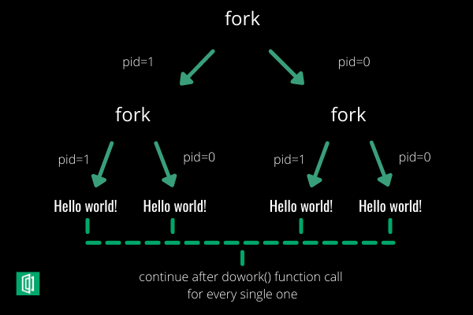

# Fork

La llamada al sistema de fork se usa para crear un nuevo proceso, que se llama _**child process**_ (proceso hijo), que se ejecuta simultáneamente con el proceso que realiza la llamada a la `fork()` (proceso principal). Después de que se crea un nuevo proceso secundario, ambos procesos ejecutarán la siguiente instrucción después de la llamada al sistema fork(). Un proceso hijo usa la misma computadora (contador de programa), los mismos registros de CPU, los mismos archivos abiertos que usa el proceso padre, basicamente es un **duplicado del proceso padre**.

```
pid_t fork(void);
```



### Retorno del fork

El sistema operativo utiliza una identificación única para cada proceso para realizar un seguimiento de todos los procesos. Y para eso, fork() no toma ningún parámetro y devuelve un valor int de la siguiente manera:

| Case           | Return value                                      |
| -------------- | ------------------------------------------------- |
| Valor positivo | Si todo va bien, retorna al padre el PID del hijo |
| Zero (0)       | Si todo va bien returna 0 al hijo recien creado   |
| Valor negativo | Si la creación de un proceso hijo no tuvo éxito.  |

> Nota: fork() es una función basada en subprocesos, para obtener el resultado correcto, ejecute el programa en un sistema local.

Gracias esto podemos especificar a cada proceso una serie de funciones distintas. Para ello utilizaremos un if en el que si es 0 significara que es el hijo, si es mayor que cero sera el padre y sino ha habido un error.

```c
int main()
{
    int id = fork();
    if (id == 0)
        printf("I'm the child\n");
    else if (id > 0)
        printf("I'm the parent\n");
    else
        printf("Eror\n");
    return (0);
}
```

### Clasificacion de procesos

Padre, hijo, heurfano, zombie

### Crear 3 procesos

Para poder crear un numero n de proecesos impares se utiliza la condicion if, expecificando que si el numero de proceso no es igual a cero, es decir si es el padre que hago un nuevo fork.

```c
#include <stdio.h> 
#include <sys/types.h> 
#include <unistd.h> 

int main()
{
    int id = fork()    //Creamos primer fork, ahora hay dos procesos
    if (id != 0)      //En el caso de que sea el padr, hace un nuevo proceso
        fork()
}
```

Mediante esta condicon solo hara un fork cuando sea el padre es decir, el hijo no podra crear un nuevo fork y por ello no tendremos 4 procesos distintos.

### Ejemplos

Pasemos a la sección práctica donde crearemos ejemplos desde el nivel simple hasta el avanzado.

#### Ejemplo 1

```c
#include <stdio.h> 
#include <sys/types.h> 
#include <unistd.h> 
int main() 
{ 
    /* fork a process */
    fork(); 
    /* the child and parent will execute every line of code after the fork (each separately)*/
    printf("Hello world!\n"); 
    return 0; 
} 
```

El resultado sera:

```
Hello world!
Hello world!
```

Donde uno de los resultados proviene del proceso principal y el otro del proceso secundario.

<figure><figcaption></figcaption></figure>

Simplemente, podemos decir que **el resultado es 2^n**, donde n es el número de llamadas al sistema fork().

Como resultado, imprimirá solo un “¡Hola mundo!”.

#### Ejemplo 2

```c
#include <stdio.h> 
#include <sys/types.h> 
#include <unistd.h> 
#include <stdlib.h>
int main() 
{ 
    fork(); 
    fork(); 
    fork(); 
    printf("Hello world!\n");
    return 0; 
}
```

El resultado es:

```bash
Hello world!
Hello world!
Hello world!
Hello world!
Hello world!
Hello world!
Hello world!
Hello world!
```

El número de veces que se imprime 'Hello world' es igual al número de procesos creados. Número total de procesos = 2n, donde n es el número de llamadas al sistema de bifurcación. Así que aquí n = 3, 2^3 = 8

Pongamos algunos nombres de etiquetas para las tres líneas:

<figure><figcaption></figcaption></figure>

#### Ejemplo 3

```c
int main() {
  if(fork() == 0)
    if(fork())
      printf("Hello world!!\n");
  exit(0);
}
```

Dibujé un breve boceto para ayudarte a entender la idea:

<figure><figcaption></figcaption></figure>

Dentro de la primera condición si se ha producido una bifurcación y está comprobando si es el proceso secundario, luego continúa ejecutando su código. De lo contrario (si es el proceso principal) no pasará por eso si. Luego, en el segundo if, solo aceptará el proceso principal que tenga la identificación positiva.

Como resultado, imprimirá solo un “¡Hola mundo!”.

### Ejemplo Avanzado

```c
#include <sys/types.h>
#include <stdio.h>
#include <unistd.h>
#include <sys/wait.h>
#include <stdlib.h>
int main(int argc, char *argv[])
{
   printf("I am: %d\n", (int) getpid());

   pid_t pid = fork();
   printf("fork returned: %d\n", (int) pid);

   if (pid < 0) { /* error occurred */
   	perror("Fork failed");
   }
   if (pid == 0) { /* child process */
   	printf("I am the child with pid %d\n", (int) getpid());
               printf("Child process is exiting\n");
               exit(0);
       }
   /* parent process */
   printf("I am the parent waiting for the child process to end\n");
       wait(NULL);
       printf("parent process is exiting\n");
       return(0);
} 
```

El resltado es el siguiente:

```
I am: 2337
fork returned: 2338
I am the parent waiting for the child process to end
fork returned: 0
I am the child with pid 2338
Child process is exiting
parent process is exiting
```

### Bibliografia

* [https://www.geeksforgeeks.org/fork-system-call/](https://www.geeksforgeeks.org/fork-system-call/)
* [https://www.section.io/engineering-education/fork-in-c-programming-language/](https://www.section.io/engineering-education/fork-in-c-programming-language/)
* [https://www.youtube.com/watch?v=VwjP-KFuZCM](https://www.youtube.com/watch?v=VwjP-KFuZCM)
* [https://www.youtube.com/watch?v=Dt9z\_ohQWHI\&t=29s](https://www.youtube.com/watch?v=Dt9z\_ohQWHI\&t=29s)
