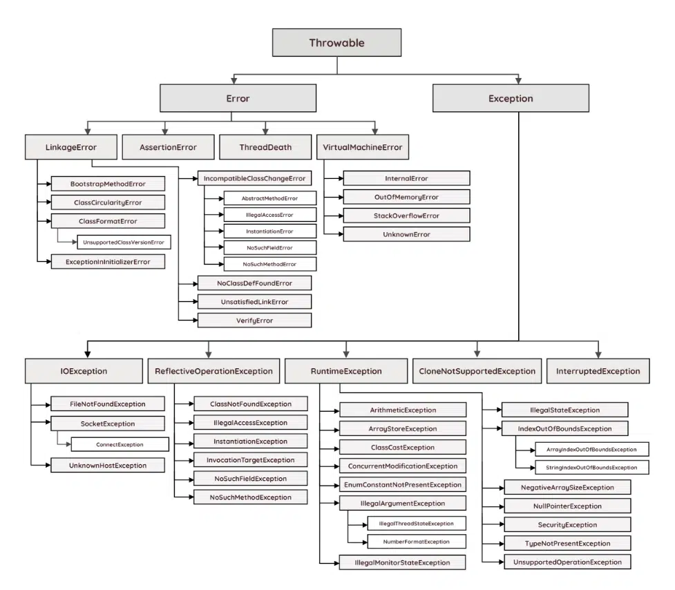

# Medidas absolutas y relativas

### Medidas Absolutas

Una medida indicada mediante unidades absolutas está completamente definida, ya que su valor no depende de otro valor de referencia. Es decir siempre tendra el mismo tamaño independientemente del dispositivo o la interaccion del usuario.

La mas utilizada es `px` (pixeles) pero también existen otras como:

* `cm`(centímetros) -> 1cm = 96px/2,54
* `mm`(milímetros) -> 1mm = 1/10 de 1cm
* `Q`(cuarto de de milímetro) -> 1Q = 1/40 de 1cm
* `in`(inches, pulgadas) -> 1in = 2,54cm = 96px
* `pc`(picas) -> 1pc = 1/16 de 1in
* `pt`(puntos) -> 1pt = 1/72 de 1in

### Medidas Relativas

La unidades relativas, a diferencia de las absolutas, no están completamente definidas, ya que su valor siempre está referenciado respecto a otro valor, por lo que permite que todos los elementos escalen proporcionalemnte. A pesar de su aparente dificultad, son las más utilizadas en el diseño web por la flexibilidad con la que se adaptan a los diferentes medios. Es decir, nos permiten crear paginas web responsive.

Las más usadas son `em`, `rem`, `%`, `vw`, `vh`, `vmin` y `vmax` aunque tenemos otras como:

* `ex` -> Altura x de la fuente del elemento.
* `ch` -> La medida del ancho del glifo "0" de la letra del elemento.
* `lh` -> Altura de la línea del elemento.

#### EM y REM

`rem` corresponde a la medida de la "m" de la raiz del documento (html). El estandar del tamaño de fuente por defecto en la raiz del documento es `16px`, que es el tamaño al que el ojo esta mas acostumbrado. Por ello no es recomendable cambair el tamño fuente.  `1rem = 16px`, es decir, 2`rem` siempre va a ser 2`rem`, puesto que el tamaño estandar de fuente no varia. Por elllo para tamaños de fuente es recomendable utilizar siempre `rem`.

> Se utiliza la "m" como referencia, porque es el caracter mas ancho que existe, por ello el tamaño de las demas letras se calcula a partir de esta.

En cambio, `em` corresponde a la medida de la "m" del contexto donde nos encontramos. Es decir un `2em` no tendra el mismo valor en un contenedor con un `font-size: 10px;`, que un un contenedor con un `font-size: 20px;`, en el primero seran `20px` y en el segundo seran `40px`.

`em` se utiliza mas cuando queremso que la medida establecida crezca en proporcionalmete al tamaño del texto. Por ejemplo si creamos un boton y queremos que su `padding` varie de tamaño dependiendo del terxto de este boton.

```css
.link{
    background-color: lightcoral;
    color: black;
    padding: 1em 2em;
    border-radius: 0.5em;
    font-szie: 2rem;
}
```

En este caso cuanto mas aumentemos el tamaño del letra, el `padding`y el `border-radius` mas grandes seran.&#x20;

#### `width: %;` y `width: auto;`

El `%` se utiliza para dar medidas en funcion del contenedor. De esta manera se puede conseguir que un elemento crezca proporcionalmente respecto a su padre, consiguiendo asi paginas responsive. El problema viene cuando se empiezan a utilizar margenes. Es decir si yo a un hijo le establezco que coga el 100% del `width` de su padre y ademas le establezco un `margin` de `20px` ocurre los siguiente:

<figure><figcaption></figcaption></figure>

Con `width: auto;` se cosnigue que el elemento coga el maximo de espacio posible, en funcion del espacio que tenga posible. Es decir con el ejemplo anterior pasaria lo siguiente:

<figure><figcaption></figcaption></figure>

En resumen, siempre o casis siempre que queiras que un elemento ocupe el 100% del with utiliza siempre `margin: auto;`.

#### `height: %;` y `height: auto;`

`width: auto;` se utiliza cuando qqueremos que el alto de un elemento se calcule con respecto al contenido de su interior. Es decir si no hay nada en su interior no sera visible la caja.


`height` es una propiedad que hay que utilizar con mucho cuidado. Si no es necesario establecer un alto, es mejor dejar que el contenido sea el que decida el alto del elemento


Por otro lado, `height: 100%;` sirve para que el elemento al que se le aplica esta propiedad coga el 100% de la altura de su padre. Sin embargo si el el padre no tienen un height declarado, como suele pasar normalmente con el `body`, todos los hijo directos a los que se les aplique esta propiedad solo ocupara la altura de su contenido y no el 100% del contenido exterior.

#### Viewport

Un viewport representa la región poligonal (normalmente rectangular) en gráficas de computación que está siendo visualizada en ese instante. En términos de navegadores web, se refiere a la parte del documento que usted está viendo, la cual es actualmente visible en su ventana (o la pantalla, si el documento está siendo visto en modo pantalla completa). El contenido fuera del viewport no es visible en la pantalla hasta que sea desplazado dentro de él.

> El area util donde se mostrara la pagina web. El area visible sin hacer scoll

Podemos usar el viewport como medida de varias formas:

* vw-> Viewport Width, hace referencia al ancho del viewport.
* vh -> Viewport Height, hace referencia al alto del viewport.
* vmax -> Utiliza el valor más grande entre el ancho y el alto del viewport.
* vmin -> Utiliza el valor más pequeño entre el ancho y el alto del viewport.

> 1vh = 1% del alto del viewport
>
> 1vmin = 1% del valor que sea más pequeño del viewport

En el caso de que queramos qque un elemnto ocupe el 100% del ancho de una pagina, no es recomendable utilizar `width: 100vw;` puesto que esto tambien en cuneta la barra de scroll y no dara un resultado que no esperamos.
