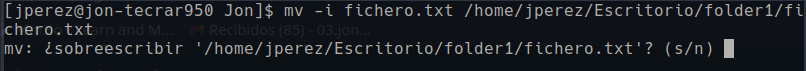

# Mv

El comando mv se usa en Linux para mover o cambiar el nombre de archivos y directorios. Cuando el comando mv mueve archivos, básicamente elimina los archivos de la fuente donde el comando cp guarda una copia del archivo.

De forma predeterminada, sobrescribirá el archivo en el destino si existe y no mostrará ningún mensaje de confirmación.

### Mover archivos

El requisito de mover archivos es, la ubicación de origen del archivo **debe ser diferente** con la ubicación de destino. Puede utilizar una ruta de archivo absoluta o relativa. Funciona tambien con **directorios**

PAra mover fichero.txt del directorio actual a otro directorio:

```
mv fichero.txt /home/Desktop/folder1
```

**IMPORTARNTE!** al mover un archivo al destino, si el destino ya tiene un archivo con el mismo nombre, obtendrá **sobrescrito**.

### Mover varios archivos

Para mover varios archivos, tan solo hay que escribirlos separados por espacios  y despues el destino

```
mv fichero1.txt fichero2.txt fichero3.txt /home/Desktop/folder1
```

En el caso de que quieras mover todos los archivos con una misma terminacion o que contengas una misma palabra... puedes utiizar el simbolo **\***

```
mv *.txt /home/Desktop/folder1
```

### Preguntar antes de sobrescribir (-i)

Cuando está moviendo un archivo a otra ubicación, y ya existe el mismo archivo, entonces, por defecto, mv lo sobrescribirá. No hay notificación emergente para esto. Para hacer una notificación para sobrescribir el archivo, podemos usar **-i** opción.

```
mv -i fichero.txt /home/Desktop/folder1
```

<figure><figcaption></figcaption></figure>

Esta notificación nos informará de la existencia de fichero.txt en la ubicación de destino. Si presionamos **«Y»** entonces el archivo se moverá; de lo contrario, no lo hará.

### Mover solo cuando el archivo sea más nuevo que el de destino (-u)

Mientras **-I** nos están notificando sobre la sobrescritura de archivos, luego **-u** opción realizará la actualización **solo si la fuente es más reciente que el archivo de destino**.

```
mv -u fichero.txt /home/Desktop/folder1
```

### No sobrescribir archivos existentes (-n)

Si **-I** options nos pregunta sobre la sobrescritura de archivos, que **-n** La opción no nos permitirá sobrescribir ningún archivo existente.

```
mv -n fichero.txt /home/Desktop/folder1
```

### Crear copia de seguridad (-b)

De forma predeterminada, los archivos en movimiento sobrescribirán los archivos de destino si ya existían antes. Pero, ¿qué sucede si está moviendo archivos incorrectos y los archivos de destino ya están sobrescritos por los nuevos? **¿Hay alguna forma de recuperar el anterior? sí hay**. Nosotros podemos usar **-B** opción. los **-B** La opción hará una copia de seguridad del archivo de destino antes de que se sobrescriba con el nuevo.

Estas copias de seguridad se crear en el la **direccion de origen** en la que estaban los ficheros que han sido movidos. Aparecera cn el simbolo **\~** al final de nombre (fichero.txt\~)

```
mv -b fichero.txt /home/Desktop/folder1
```

### Otros Flags

| Flags       | Descripcion                                                              |
| ----------- | ------------------------------------------------------------------------ |
| -v, verbose | Proporcione salida detallada . Imprima el nombre de cada archivo movido. |
| -f, -force  | Siempre sobrescribe los archivos existentes sin preguntar                |
| -t          |  mueve todas la fuentes al destino del directorio                        |

### Bibliografia

* [https://conpilar.kryptonsolid.com/comando-linux-mv-con-ejemplos/](https://conpilar.kryptonsolid.com/comando-linux-mv-con-ejemplos/)
* [https://ayudalinux.com/como-usar-el-comando-mv/](https://ayudalinux.com/como-usar-el-comando-mv/)
